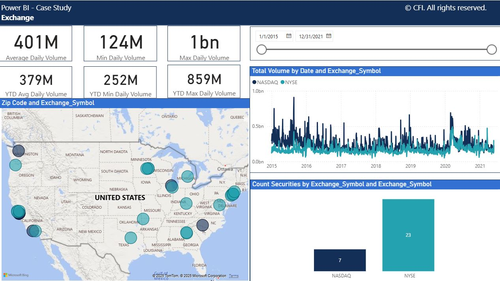
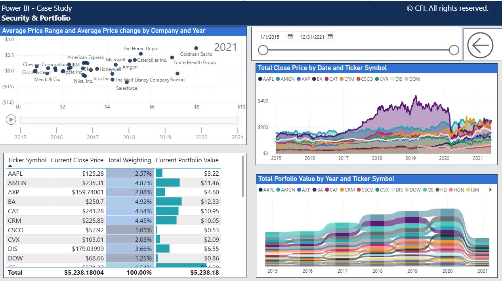

# CFI-Capital-Partners-Investment-Portfolio-Analysis-Power-BI-

## 📌 Project Overview
This project was developed as part of a case study for **CFI Capital Partner**, an investment bank.  
The **Sales & Trading team** required a customized Power BI report to analyze market activity and investment portfolios.  

The solution connects to multiple financial datasets, applies **data modeling and DAX measures**, and delivers two interactive dashboards:  
1. **Exchange Dashboard**  
2. **Securities & Portfolio Dashboard**  

---

## 📈 Report Dashboards

### 1. Exchange Dashboard
**Objectives**
- Identify which exchanges securities come from  
- Map geographic distribution of securities  
- Show the most popular exchanges by traded volume  

**Key DAX Measures**
- Daily traded volume  
- Year-to-date traded volume  

**Preview**

  

---

### 2. Securities & Portfolio Dashboard
**Objectives**
- Understand relationships between securities and their performance  
- Analyze security performance over time  
- Compare top- and under-performing securities using a ribbon chart  

**Features**
- Calculated columns and DAX measures for portfolio analysis  
- Ribbon chart and line chart combination  
- Conditional formatting for quick interpretation  

**Preview**

  

---

## 🎨 Report Interactivity
- **Drillthrough**: Navigate from Exchange Dashboard to Security details  
- **Bookmarks**:  
  - Reset all filters  
  - Toggle between ribbon chart and line chart  
- **Conditional formatting** in table visuals  
- **Interactive tooltips** across visuals  

---

## 🛠️ Skills Applied
- Power Query (data transformation)  
- Data modeling in Power BI  
- Advanced DAX measures and calculated columns  
- Dashboard interactivity (drillthrough, bookmarks, formatting)  
- Best practices in financial reporting & visualization  

---
## 📂 Repository Structure
- InvestmentPortfolio.pbix → Power BI Desktop file
- images/ → Dashboard screenshots
- README.md → Project description

---

## 🚀 How to Use
1. Clone this repository.  
2. Open `PowerBI_Case_Study.pbix` in **Power BI Desktop**.  
3. Explore the dashboards and interact with slicers, drillthrough, and bookmarks.  

---

## 📌 Purpose
This project demonstrates applied skills in **Power BI financial analysis**, **DAX modeling**, and **dashboard interactivity**.  
It highlights the ability to transform raw financial data into actionable insights for trading and portfolio management.  

---
